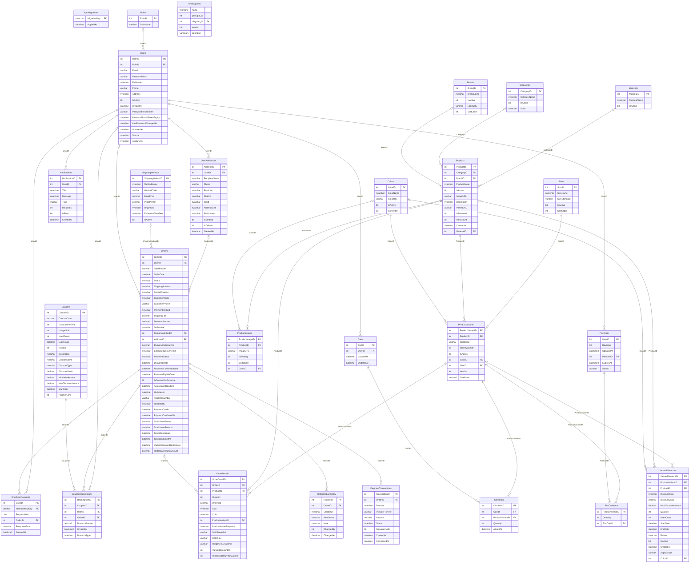

# ERD ShoeGroup

Duoc tao tu database thuc te; AppMigrations la bang ky thuat.

```mermaid
erDiagram
  AppMigrations {
    nvarchar MigrationKey PK
    datetime AppliedAt
  }
  Brands {
    int BrandID PK
    nvarchar BrandName
    bit IsActive
    varchar LogoURL
    int SortOrder
  }
  CartItems {
    int CartItemID PK
    int CartID FK
    int ProductVariantID FK
    int Quantity
    datetime AddedAt
  }
  Carts {
    int CartID PK
    int UserID FK
    datetime CreatedAt
    datetime UpdatedAt
  }
  Categories {
    int CategoryID PK
    nvarchar CategoryName
    bit IsActive
    nvarchar Sport
  }
  CheckoutRequests {
    int UserID PK
    varchar IdempotencyKey PK
    char RequestHash
    int OrderID FK
    nvarchar ResponseJson
    datetime2 CreatedAt
  }
  Colors {
    int ColorID PK
    nvarchar ColorName
    varchar ColorHex
    bit IsActive
    int SortOrder
  }
  CouponRedemptions {
    int RedemptionID PK
    int CouponID FK
    int UserID FK
    int OrderID FK
    decimal DiscountAmount
    datetime2 CreatedAt
    nvarchar DiscountType
  }
  Coupons {
    int CouponID PK
    varchar CouponCode
    int DiscountPercent
    int UsageLimit
    int UsedCount
    datetime ExpiryDate
    bit IsActive
    nvarchar Description
    nvarchar CouponName
    nvarchar DiscountType
    decimal DiscountValue
    decimal MinOrderAmount
    decimal MaxDiscountAmount
    datetime StartDate
    int PerUserLimit
  }
  Materials {
    int MaterialID PK
    nvarchar MaterialName
    bit IsActive
  }
  Notifications {
    int NotificationID PK
    int UserID FK
    nvarchar Title
    nvarchar Message
    varchar Type
    int RelatedID
    bit IsRead
    datetime CreatedAt
  }
  OrderDetails {
    int OrderDetailID PK
    int OrderID FK
    int ProductID FK
    int Quantity
    decimal UnitPrice
    nvarchar Size
    nvarchar Color
    int ProductVariantID FK
    nvarchar ProductNameSnapshot
    varchar SKUSnapshot
    varchar ColorHex
    varchar ImageURLSnapshot
    int VariantDiscountID
    int HistoricalReturnedQuantity
  }
  Orders {
    int OrderID PK
    int UserID FK
    decimal TotalAmount
    datetime OrderDate
    nvarchar Status
    nvarchar ShippingAddress
    nvarchar CancelReason
    nvarchar CustomerName
    varchar CustomerPhone
    nvarchar PaymentMethod
    decimal ShippingFee
    decimal DiscountAmount
    nvarchar OrderNote
    int ShippingMethodID FK
    int AddressID FK
    decimal DeliveryDistanceKm
    nvarchar EstimatedDeliveryText
    nvarchar PaymentStatus
    datetime DeliveredDate
    datetime ReceivedConfirmedDate
    datetime RevenueEligibleDate
    bit IsCountedAsRevenue
    datetime AutoCancelDeadline
    datetime UpdatedAt
    varchar TrackingNumber
    nvarchar HandledBy
    datetime PaymentDueAt
    datetime PaymentConfirmedAt
    nvarchar StockIssueStatus
    nvarchar StockIssueReason
    datetime StockRestoredAt
    datetime StockDeductedAt
    datetime VariantDiscountRestoredAt
    decimal HistoricalRefundAmount
  }
  OrderStatusHistory {
    int HistoryID PK
    int OrderID FK
    nvarchar OldStatus
    nvarchar NewStatus
    nvarchar Note
    int ChangedBy
    datetime ChangedAt
  }
  PaymentTransactions {
    int TransactionID PK
    int OrderID FK
    nvarchar Provider
    varchar ProviderTxnRef
    decimal Amount
    nvarchar Status
    bit SignatureValid
    datetime CreatedAt
    datetime CompletedAt
  }
  PosCartItems {
    int ProductVariantID PK
    int Quantity
    int PosCartID PK
  }
  PosCarts {
    int UserID FK
    int Revision
    datetime2 UpdatedAt
    int PosCartID PK
    datetime2 ExpiresAt
    varchar Status
  }
  ProductImages {
    int ProductImageID PK
    int ProductID FK
    varchar ImageURL
    bit IsPrimary
    int SortOrder
    int ColorID FK
  }
  Products {
    int ProductID PK
    int CategoryID FK
    int BrandID FK
    nvarchar ProductName
    bit IsActive
    varchar ImageURL
    nvarchar Description
    varchar ParentSKU
    bit IsFeatured
    int ViewCount
    datetime CreatedAt
    int MaterialID FK
  }
  ProductVariants {
    int ProductVariantID PK
    int ProductID FK
    varchar ChildSKU
    int StockQuantity
    bit IsActive
    int ColorID FK
    int SizeID FK
    int Version
    decimal SalePrice
  }
  Roles {
    int RoleID PK
    varchar RoleName
  }
  ShippingMethods {
    int ShippingMethodID PK
    nvarchar MethodName
    varchar MethodCode
    decimal BasePrice
    decimal PricePerKm
    nvarchar OriginCity
    nvarchar EstimatedTimeText
    bit IsActive
  }
  Sizes {
    int SizeID PK
    nvarchar SizeName
    varchar SizeStandard
    bit IsActive
    int SortOrder
  }
  sysdiagrams {
    sysname name
    int principal_id
    int diagram_id PK
    int version
    varbinary definition
  }
  UserAddresses {
    int AddressID PK
    int UserID FK
    nvarchar RecipientName
    varchar Phone
    nvarchar Province
    nvarchar District
    nvarchar Ward
    nvarchar AddressLine
    nvarchar FullAddress
    bit IsVerified
    bit IsDefault
    datetime CreatedAt
  }
  Users {
    int UserID PK
    int RoleID FK
    varchar Email
    varchar PasswordHash
    nvarchar FullName
    varchar Phone
    nvarchar Address
    bit IsActive
    datetime CreatedAt
    varchar PasswordResetToken
    datetime PasswordResetTokenExpiry
    datetime LastPasswordChangedAt
    datetime UpdatedAt
    nvarchar Source
    nvarchar AvatarURL
  }
  VariantDiscounts {
    int VariantDiscountID PK
    int ProductVariantID FK
    int ProductID FK
    nvarchar DiscountType
    decimal DiscountValue
    decimal MaxDiscountAmount
    int Quantity
    int UsedCount
    datetime StartDate
    datetime EndDate
    nvarchar Reason
    bit IsActive
    datetime CreatedAt
    varchar ApplyScope
    int ColorID FK
  }
  Orders ||--o{ CheckoutRequests : "OrderID"
  Users ||--o{ CheckoutRequests : "UserID"
  Coupons ||--o{ CouponRedemptions : "CouponID"
  Orders ||--o{ CouponRedemptions : "OrderID"
  Users |o--o{ CouponRedemptions : "UserID"
  Orders |o--o{ OrderDetails : "OrderID"
  Products |o--o{ OrderDetails : "ProductID"
  Users |o--o{ Orders : "UserID"
  Brands |o--o{ Products : "BrandID"
  Categories |o--o{ Products : "CategoryID"
  Roles |o--o{ Users : "RoleID"
  Carts ||--o{ CartItems : "CartID"
  ProductVariants ||--o{ CartItems : "ProductVariantID"
  Users ||--o{ Carts : "UserID"
  Users ||--o{ Notifications : "UserID"
  ProductVariants |o--o{ OrderDetails : "ProductVariantID"
  ShippingMethods |o--o{ Orders : "ShippingMethodID"
  UserAddresses |o--o{ Orders : "AddressID"
  Orders ||--o{ OrderStatusHistory : "OrderID"
  PosCarts ||--o{ PosCartItems : "PosCartID"
  ProductVariants ||--o{ PosCartItems : "ProductVariantID"
  Users ||--o{ PosCarts : "UserID"
  Colors |o--o{ ProductImages : "ColorID"
  Products ||--o{ ProductImages : "ProductID"
  Materials |o--o{ Products : "MaterialID"
  Colors ||--o{ ProductVariants : "ColorID"
  Products ||--o{ ProductVariants : "ProductID"
  Sizes ||--o{ ProductVariants : "SizeID"
  Orders ||--o{ PaymentTransactions : "OrderID"
  Users ||--o{ UserAddresses : "UserID"
  Colors |o--o{ VariantDiscounts : "ColorID"
  Products |o--o{ VariantDiscounts : "ProductID"
  ProductVariants |o--o{ VariantDiscounts : "ProductVariantID"
```
